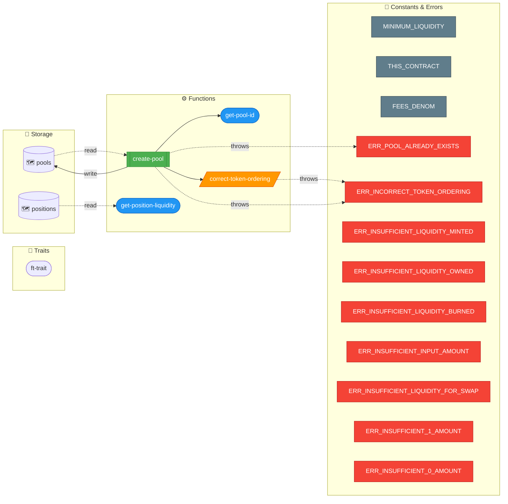
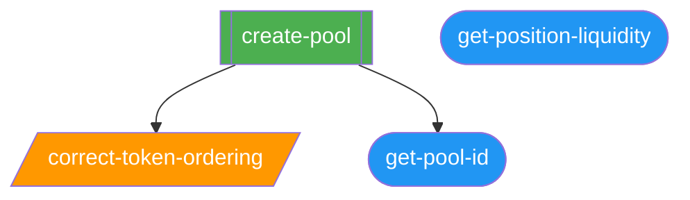
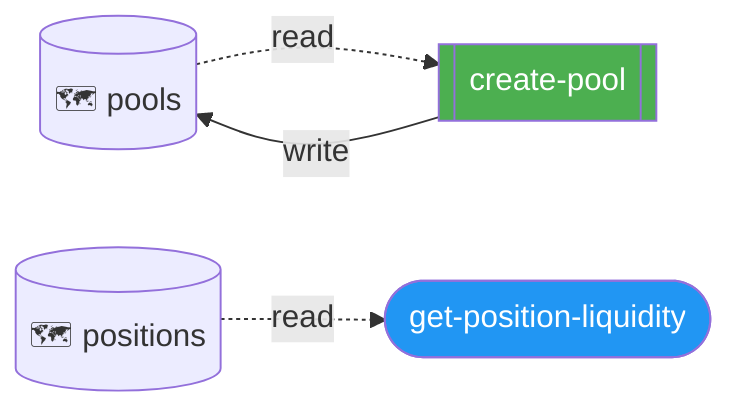
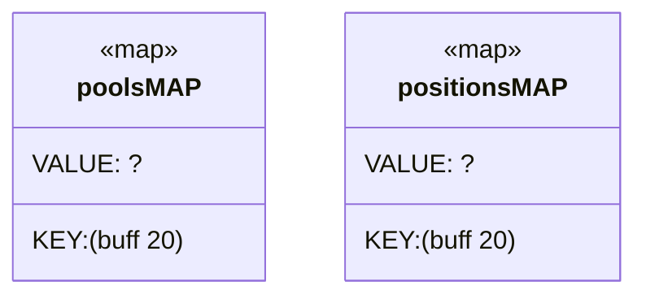
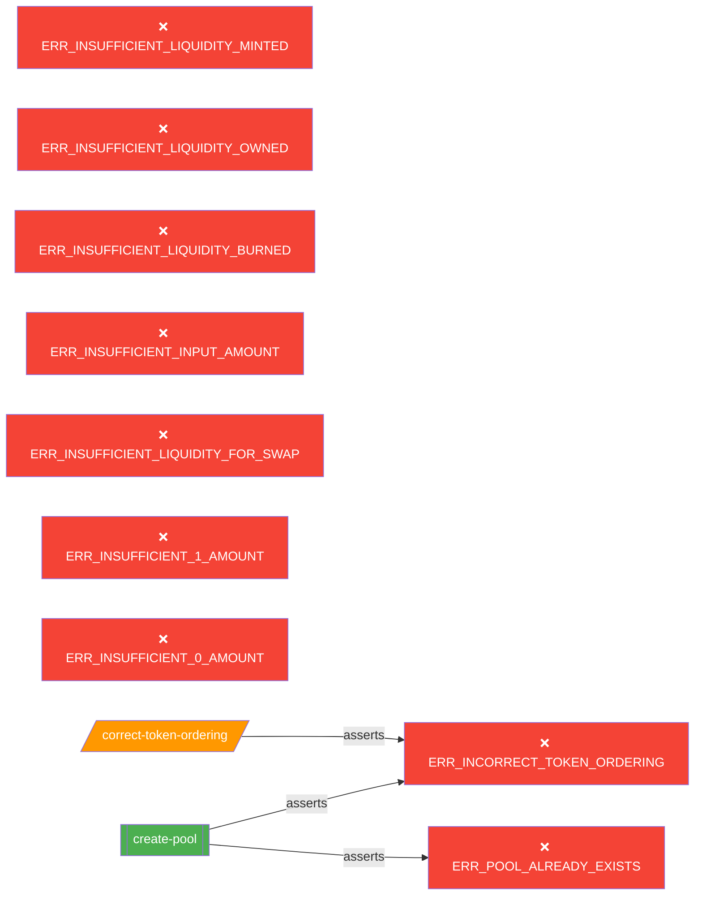

# 📊 Clarity Contract Analysis: `amm`

## 📋 Summary

| Component | Count |
|---|---|
| Traits used | 1 |
| Constants | 3 |
| Errors | 9 |
| Maps | 2 |
| Data Vars | 0 |
| Tokens | 0 |
| Public functions | 1 |
| Read-only functions | 2 |
| Private functions | 1 |

## 🏗️ Architecture

> Funciones, storage, traits y relaciones entre ellos.

## 📞 Call Graph

## 🔄 Data Flow

> Accesos de lectura/escritura al storage.

## 🗺️ Storage Schema

## ❌ Error Paths

## ⚙️ Function Details

| Function | Type | Params | Map R | Map W | Var R | Var W | Asserts | Calls |
|---|---|---|---|---|---|---|---|---|
| `get-pool-id` | read-only | — | — | — | — | — | 0 | pool-id, buff, pool-info |
| `correct-token-ordering` | private | — | — | — | — | — | 1 | token-0, token-0-buff, token-1, token-1-buff |
| `create-pool` | public | — | pools | pools | — | — | 2 | correct-token-ordering, pool-does-not-exist, pool-id, fee, token-1-principal, pool-info, token-1, token-0-principal, pool-data, token-0, get-pool-id |
| `get-position-liquidity` | read-only | — | positions | — | — | — | 0 | pool-id, buff, position, existing-owner-liquidity, owner |

## 🔗 Traits

- `ft-trait` → `'SP3FBR2AGK5H9QBDH3EEN6DF8EK8JY7RX8QJ5SVTE.sip-010-trait-ft-standard.sip-010-trait)`
