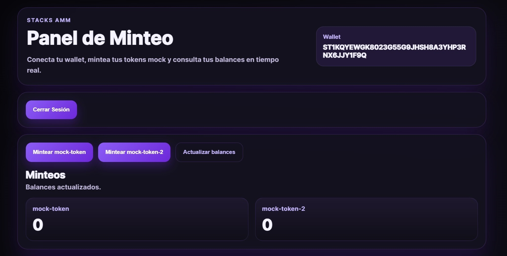
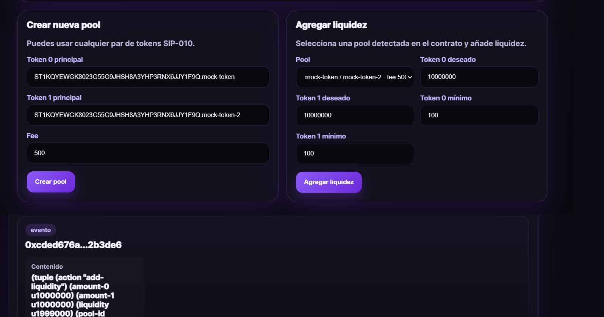
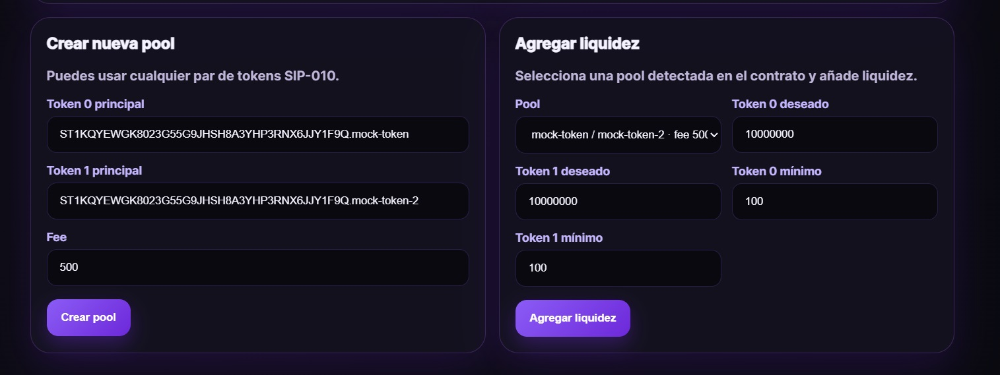

# Simple AMM DEX — Clarity Smart Contract

An Automated Market Maker (AMM) built with Clarity on the Stacks blockchain.  
This contract is inspired by Uniswap V2 and allows users to create liquidity pools, add and remove liquidity, and swap tokens.

## Features

- Create liquidity pools with different fee levels
- Add liquidity with slippage protection
- Remove liquidity
- Swap tokens (zero-for-one and one-for-zero)
- Constant product formula (`x * y = k`)
- Special handling for the first liquidity provider
- Fees that benefit Liquidity Providers (LPs)

## How It Works

1. **create-pool** — Creates a new pool with two SIP-010 tokens and a fee.
2. **add-liquidity** — Adds liquidity to a pool. The first LP can use any ratio. Later LPs must respect the current pool ratio.
3. **remove-liquidity** — Removes liquidity and receives tokens back.
4. **swap** — Swaps one token for another while keeping the constant product.
5. **get-pool-data** & **get-position-liquidity** — Read-only functions for the frontend.

## Main Functions

| Function                                                  | Type      | Description                             |
| --------------------------------------------------------- | --------- | --------------------------------------- |
| `create-pool(token-0, token-1, fee)`                      | Public    | Creates a new liquidity pool            |
| `add-liquidity(...)`                                      | Public    | Adds liquidity with slippage protection |
| `remove-liquidity(token-0, token-1, fee, liquidity)`      | Public    | Removes liquidity from the pool         |
| `swap(token-0, token-1, fee, input-amount, zero-for-one)` | Public    | Performs a token swap                   |
| `get-pool-data(pool-id)`                                  | Read-only | Returns pool information                |
| `get-position-liquidity(pool-id, owner)`                  | Read-only | Returns user's liquidity (L)            |

## Error Codes

| Code   | Description                     |
| ------ | ------------------------------- |
| `u200` | Pool already exists             |
| `u201` | Incorrect token ordering        |
| `u202` | Insufficient liquidity minted   |
| `u203` | Not enough liquidity owned      |
| `u204` | Insufficient liquidity burned   |
| `u205` | Insufficient input amount       |
| `u206` | Insufficient liquidity for swap |
| `u207` | Insufficient amount of token 1  |
| `u208` | Insufficient amount of token 0  |

## Demo





## Tech Stack

- [Clarity](https://docs.stacks.co/clarity/overview) — Smart contract language
- [Stacks](https://www.stacks.co/) — Bitcoin Layer 2 blockchain
- SIP-010 — Fungible Token Standard
- Clarinet — Development and testing tool

## Testing

Tests are written with **Clarinet** and **Vitest**:

```bash
clarinet test
```

## Tech Stack

- [Clarity](https://docs.stacks.co/clarity/overview) — Smart contract language
- [Stacks](https://www.stacks.co/) — Bitcoin L2 blockchain
- [Clarinet](https://github.com/hirosystems/clarinet) — Development & testing toolchain
- [Vitest](https://vitest.dev/) — Test runner

## Author

**Gustavo Nicolás Castellón**  
GitHub: [@ichbinzeed](https://github.com/ichbinzeed)  
LinkedIn: [ichbinzeed](https://linkedin.com/in/ichbinzeed)
